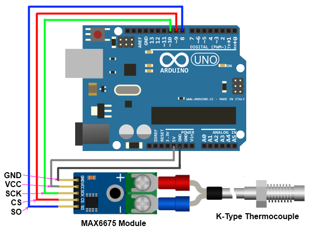

# MAX6675 Thermocouple Library

For Arduino boards.

The Library implements a set of methods for working with a thermocouple based on the MAX6675 driver.
Provides a temperature reading in Celsius, Fahrenheit and Kelvin.
Modified version of the [MAX6675-library](https://github.com/adafruit/MAX6675-library).

MAX6675 driver measures the output of a K Thermocouple and provides the result to the Arduino via a SPI interface.

## Installation

1. [Download](https://github.com/YuriiSalimov/MAX6675_Thermocouple/releases) the Latest release from gitHub.
2. Unzip and modify the Folder name to "MAX6675_Thermocouple" (Remove the '-version')
3. Paste the modified folder on your Library folder (On your `libraries` folder inside Sketchbooks or Arduino software).
4. Restart the Arduino IDE.

## Circuit Diagram



SO: The module’s serial output. Your Arduino will read this output.

CS: Chip Select. Setting low, selects the Module and tells it to supply an output that is synchronize with a clock.

SCK: The Serial Clock, an input from your Arduino.

VCC: 5V supply

GND: Ground.

## Methods

```cpp
    // Instantiation:
    /**
        SCK_PIN - SCK digital port number.
        CS_PIN - CS digital port number.
        SO_PIN - SO digital port number.
    */
    MAX6675_Thermocouple thermocouple(SCK_PIN, CS_PIN, SO_PIN);

    // or
    /**
    	READINGS_NUMBER - How many readings are taken to determine
        a mean temperature. The more values, the longer a calibration
        is performed, but the readings will be more accurate.
    	DELAY_TIME - Delay time between a temperature readings (ms).
    */
    MAX6675_Thermocouple thermocouple(
		SCK_pin, CS_pin, SO_pin,
		READINGS_NUMBER, DELAY_TIME
	);

    // Read a temperature in Celsius.
    double celsius = thermocouple.readCelsius();
    // Read a temperature in Kelvin.
    double Kelvin = thermocouple.readKelvin();
    // Read a temperature in Fahrenheit.
    double fahrenheit = thermocouple.readFahrenheit();
    // For older devices.
    double farenheit = thermocouple.readFarenheit();

    // Sets a new readings number.
    thermocouple.setReadingsNumber(READINGS_NUMBER);
    // Sets a new delay time.
    thermocouple.setDelayTime(DELAY_TIME);
```

Created by [Yurii Salimov](mailto:yuriy.alex.salimov@gmail.com).
